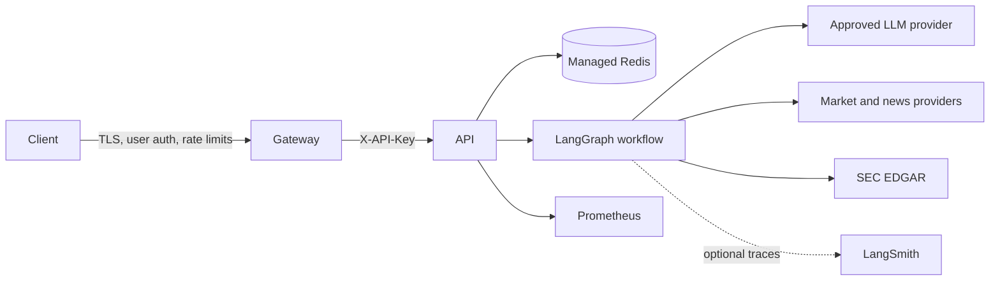

# Architecture

## System context

The service accepts bounded research requests, authenticates the calling service, records job state in Redis, and executes a LangGraph workflow. The research node asks an LLM to select allowlisted data tools; the analyst node validates model-generated JSON against a strict runtime schema before publishing a report.

## Trust boundaries

- The gateway owns user identity, authorization, TLS, abuse prevention, and per-client rate limits.
- The API key authenticates only the gateway or calling service.
- LLM output and provider payloads are untrusted. Report JSON is schema validated; tool selection is restricted to the static tool map.
- Redis contains job inputs, status, provider-derived content, and generated reports. Use TLS, authentication, encryption at rest, network isolation, and bounded retention.
- Metrics and traces can disclose usage patterns or financial context and must remain on controlled networks.

## State and execution

Status and result records use separate Redis namespaces and expire after `CACHE_TTL_SECONDS`. Redis operations fail explicitly after a persistent backend has been selected; the service does not silently split state across replicas.

Workflow execution currently uses FastAPI `BackgroundTasks`. This provides asynchronous HTTP behavior but not durable queue semantics. See [Failure modes](failure-modes.md) before assigning delivery guarantees.

## Supply chain

The runtime dependency graph is hash locked in `requirements.lock`. The image uses a digest-pinned base, runs without root or pip, and is scanned with digest-pinned Trivy. CI publishes image provenance, an SBOM attestation, and an image-derived CycloneDX artifact.
