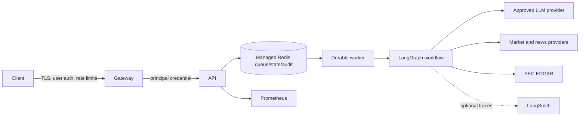

# Architecture

## System context

The service accepts bounded research requests, authenticates a tenant-scoped service principal, and durably enqueues work in Redis. Dedicated workers execute the LangGraph workflow with leases and capped retries. The research node asks an LLM to select allowlisted data tools; the analyst node validates grounded, cited JSON against a strict runtime schema. Reports remain withheld until an approver releases them.

## Trust boundaries

- The gateway owns end-user identity, TLS, network policy, and edge abuse prevention.
- The API authenticates independently salted, PBKDF2-derived service-principal credentials and enforces tenant boundaries and `reader`, `researcher`, `approver`, and `admin` roles.
- Redis-backed rate and concurrency controls operate across API replicas. They complement, rather than replace, gateway controls.
- LLM output and provider payloads are untrusted. Tool selection is allowlisted, external content is bounded and screened for prompt injection, and report citations must reference the source registry.
- Redis contains job inputs, status, provider-derived content, and generated reports. Use TLS, authentication, encryption at rest, network isolation, and bounded retention.
- Metrics and traces can disclose usage patterns or financial context and must remain on controlled networks.

## State and execution

Status and result records use separate Redis namespaces and expire after `JOB_RETENTION_SECONDS` (30 days by default, including approval time). Queue envelopes use an idempotency set, ready/in-flight lists, lease and retry sorted sets, and a dead-letter list. Delivery is **at least once**; consumers must use the job ID as the idempotency boundary.

Workers renew leases during active processing, recover expired leases, apply exponential retry backoff, and dead-letter work after `JOB_MAX_ATTEMPTS`. Reconciled dead letters are drained after terminal status and tenant capacity are repaired. A successful graph run transitions to `awaiting_approval` by default; only an approver in the same tenant can expose the report. Governance events are hash chained in a bounded Redis stream.

## Agent safety and provenance

- Per-job model and tool-call ceilings prevent unbounded ReAct loops.
- Ordered LLM fallbacks reduce single-provider dependency; tool circuit breakers isolate repeated failures.
- Each accepted tool result receives a deterministic source ID, provider/type, retrieval time, ticker, and locator.
- The report schema requires citations and rejects IDs outside the supplied registry.
- Pattern screening is defense in depth, not a proof that all prompt injection is detected. Human approval remains mandatory for consequential use.

## Supply chain

The runtime dependency graph is hash locked in `requirements.lock`. The image uses a digest-pinned base, runs without root or pip, and is scanned with digest-pinned Trivy. CI publishes image provenance, an SBOM attestation, and an image-derived CycloneDX artifact.
